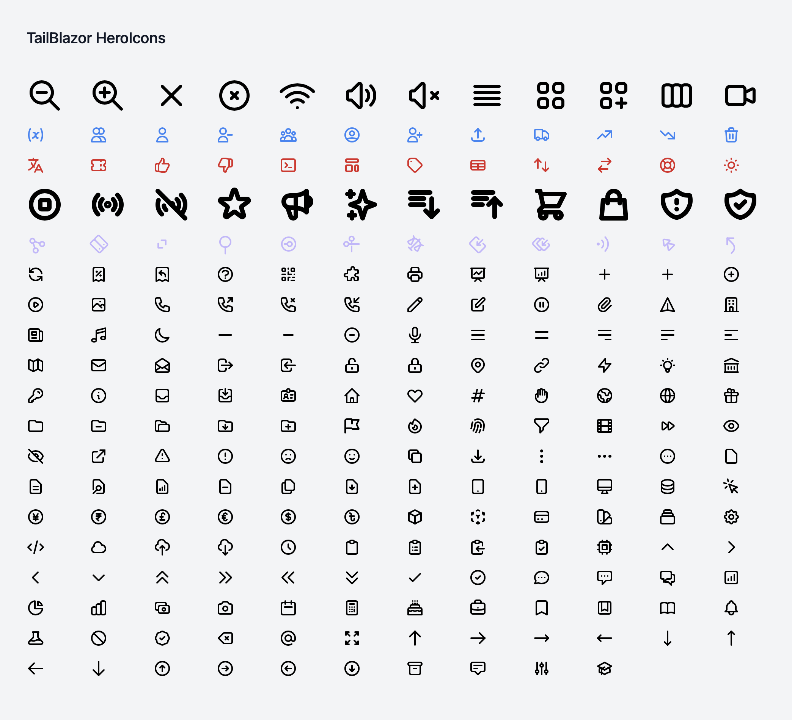

# TailBlazor.HeroIcons

Tailwindcss HeroIcons for Blazor!

This package includes all 226 icons in the HeroIcon pack as of Version 0.4.1.

The full icon pack can be previewed here: [HeroIcons.com](https://heroicons.com)

This pack allows you to modify: size, stroke(colour), stroke width, width and height, and style (outlined or solid) for all the icons in an easy package with easy searching of available icons.




## Getting Setup

You can install the package via the NuGet package manager just search for TailBlazor.HeroIcons. You can also install via powershell using the following command.

`Install-Package TailBlazor.HeroIcons`

Or via the dotnet CLI.

`dotnet add package TailBlazor.HeroIcons`

### 1. Add Imports

Add line to your \_Imports.razor

```
@using TailBlazor.HeroIcons
```

### 2. Create HeroIcon Component

Add `TailBlazorHeroIcon` to your Blazor component and select the icon using `HeroIcon` enum.
Due to enum limitations they have been modified to removed '-'. You now must specify a colour or the icon may not show up. This allows for styles to fall down into the component.

`clipboard-copy` has been changed to `ClipboardCopy`

```
<TailBlazorHeroIcon Icon="HeroIcon.X" Class="text-blue-500" />
```

### 3. Customization

By default you don't need to include anything but the `Icon` parameter. However if you want to customize aspects of the icon you can. by default they all have base values. The follow parameters are available

Parameter | Default Value
--- | ---
`Width` | `64`
`Height` | `64`
`StrokeWidth` | `2`
`Class` | `text-black`
`IconStyle` | `IconStyle.Outline`
`EnableComments` | `false`

Width, Height, and StrokeWidth all take an int.

class takes any tailwind text colour you've added to your project: `text-blue-500`. The fill is erased when building the SVG and this is put at a class instead. Because this is set as a class inside the `class` variable you can add additional classes to further customize the icon.

`<TailBlazorHeroIcon class="text-purple-300 transform rotate-45" Icon="HeroIcon.Share" />`

By adding the transform rotate-45 to the class the icon will also be rotated 45 degrees. You can also add animation classes.


IconStyle accepts `.Outline` and `.Solid`

when comments are enabled they can allow it easier for you to remember what you've used when inspecting an element for debugging.
Enabling it shows the following comment above the icon.


`<!-- HeroIcon: annotation (style: outlined, size: 64x64, stroke (colour): text-grey-500, stroke-width: 2) -->`


SPECIAL NOTE TO PURGING TAILWINDCSS.

Sometimes we don't use all the styles and tailwind will purge them. If you find your icon's not styling, make sure stroke-current is added to your website tailwindcss purged code.